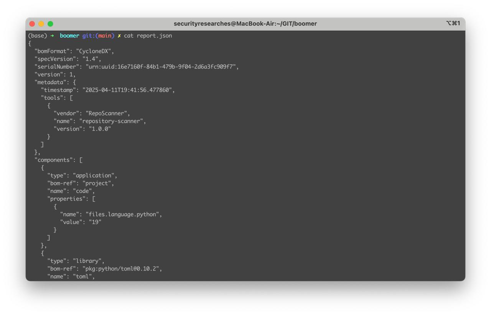

🚗 Boomer



Boomer is like your old car — easy to drive, and a joy every time.

It’s a universal SBOM (Software Bill of Materials) generator that lists all your project dependencies in a single, clean JSON. No need to specify the language — Boomer automatically detects it and uses the appropriate parser to gather the libraries.

🔍 No configuration.

🧠 No guesswork.

📦 Just one command and you get your full dependency list.

And the best part? We didn’t reinvent the wheel.

Boomer outputs in CycloneDX — the industry-standard format for BOM files.

```
docker run -it --rm -v $(pwd):/code whitespots/boomer:latest boomer scan /code -o /code/report.json
```
